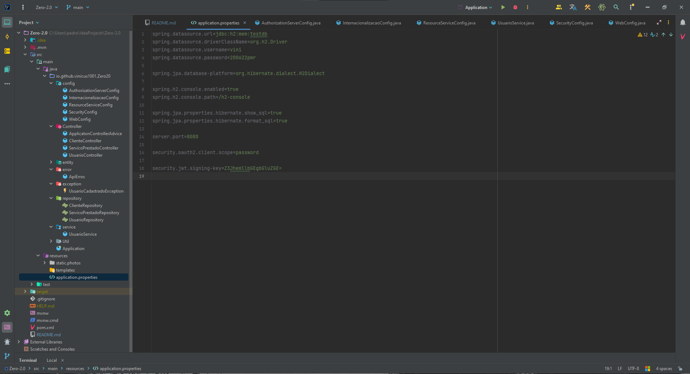

**Projeto de aprendizado com Angular 11 + Spring Boot.**

## **SOBRE O PROJETO**

O projeto de back-end em questão foi desenvolvido como parte de uma aplicação web voltada para a criação de clientes e seus serviços prestados. Ele desempenha um papel fundamental no gerenciamento desses dados, proporcionando funcionalidades para criar, atualizar, recuperar e excluir informações relacionadas aos clientes e seus serviços. Como também para login de usuarios e seus (CRUD) 
***
## **ASSUNTOS TRABALHADOS E ESTUDADOS NO DECORRER DO PROJETO**

- Criação e Entendimento de um Projeto Spring Boot e sua Arquitetura
- Classes de Configuração e Serviços
- Injeção de Depedencias.
- Configurar e se Conectar com Banco de Dados ( H2 DATABASE  )
- Mapeamento de Entidades JPA (EntityMenager)
- JPA Repositories
- Query e @Query
- Implementar uma RESTFuL
- Mapear recursos REST
- Conhecimentos nas operações de POST, DELETE, GET, PUT, PATCH
- Conhecendo e utilizando códigos de Status apropiados
- LOMBOK project
- Bean Validation
- Internacionalização
- Autorização de url's de acordo com os perfis de usuario.
- Implementar Autenticação 
- Conficuração de WebSecurity
- Build e Deploy
- JAR e WAR
- Cross Origin
- Relacionamento de Entidades
- Testes Postman
- Conhecimentos em Token JWT
- oauth2 e suas configurações
- PasswordEncoder
- DTO (Data Transfer Object)
***
## **FERRAMENTAS UTILIZADAS**

As seguintes ferramentas foram utilizadas durante o desenvolvimento do projeto:
- 
- 

- 

- 
- 

- 

***

## **TECNOLIGIAS UTILIZADAS**

As seguintes tecnologias foram utilizadas durante o desenvolvimento do projeto:

- 

-  
- 

-  

**PRÉ-REQUISITOS PARA RODAR PROJETO**
- 
- 
- 

***
## **COMO RODAR PROJETO**

<h7 align="center">1️⃣</h7> - Clone o projeto : https://github.com/viniciusDias1001/Clients_Back_Api.git

<h7 align="center">2️⃣</h7> - Abra o projeto e instale as dependencias maven:  `mvn install`

<h7 align="center">3️⃣ </h7> - Vá em application.properties e altere as informações para seu H2 DATABASE:

<h7 align="center">4️⃣ </h7> - Siga para classe `Application` e de  
no metodo main:

# Pronto vai está rodando, basta agora ir no front

OBS: Caso tenha alguma duvida entre em contato.

---
# Get in touch

- 

- 

**PARA TER ACESSO AO FRONT DO PROJETO ACESSE:** https://github.com/viniciusDias1001/Clients-Front_Angular.git

